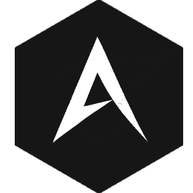

<h1 align="center">Andalia Launcher</h1>

<em><h5 align="center">(formerly Electron Launcher)</h5></em>

[
](https://travis-ci.org/dscalzi/HeliosLauncher)  

Basé sur le travaille de Daniel Scalzi : https://github.com/dscalzi/HeliosLauncher
